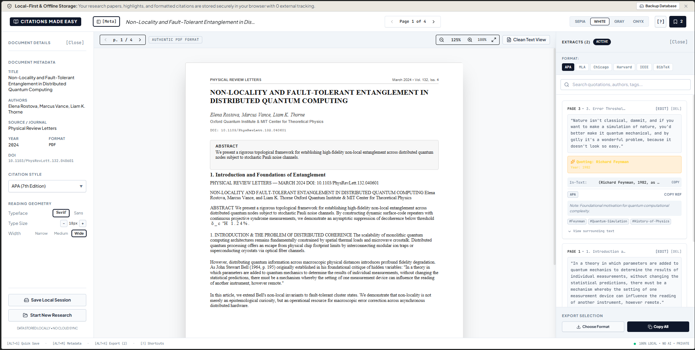
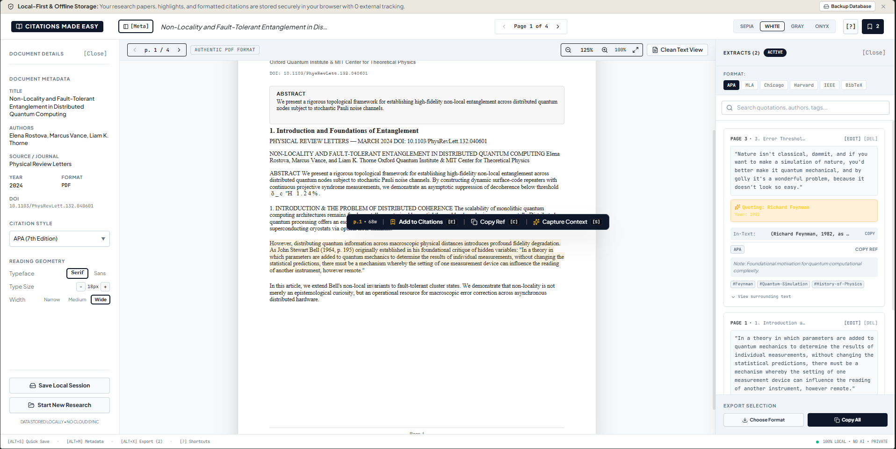
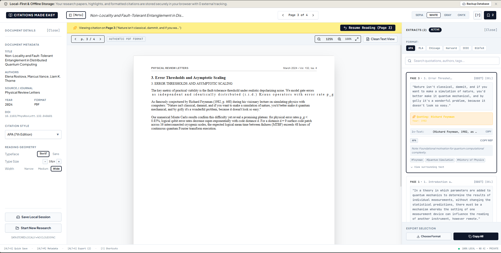
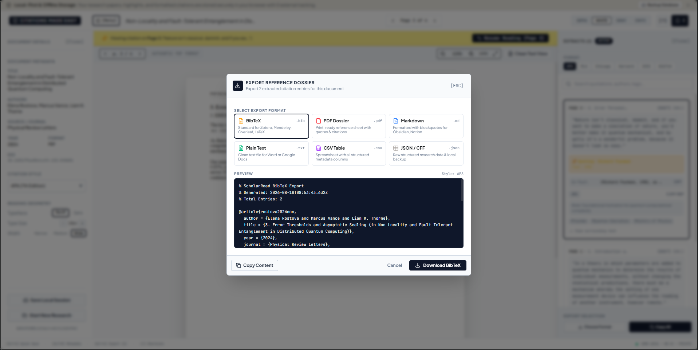

# Citations Made Easy 📖✨

> A minimalist, local-first academic research reader and intelligent citation extraction engine. Read PDFs, EPUBs, and web articles with authentic visual layout preservation, extract perfectly formatted multi-style citations with a single keystroke, capture surrounding context, and export to BibTeX, Markdown, RIS, CSV, and JSON.

[](https://opensource.org/licenses/MIT)
[](https://ai.studio)
[](https://reactjs.org/)
[](https://www.typescriptlang.org/)
[](https://tailwindcss.com/)
[](#method-3-docker--docker-compose-recommended)
[](#security-hardening--localhost-only-access)

---

## 📸 Screenshots

*(Replace the image links below with your screenshots saved in `docs/screenshots/`)*

| Main Reader & PDF Canvas | Capture Context & Selection Toolbar |
| :---: | :---: |
| <br><sub>*Authentic PDF rendering with equations, tables & multi-column layouts*</sub> | <br><sub>*Floating toolbar with [E] Extract, [C] Quick Copy, and [S] Capture Context*</sub> |

| Reference Manager Drawer | Multi-Format Academic Export |
| :---: | :---: |
| <br><sub>*Searchable citation cards with in-text references & jump-to-quote navigation*</sub> | <br><sub>*One-click export to BibTeX, Markdown with YAML, RIS, CSV, and JSON*</sub> |

---

## 🌟 Key Features

### 1. Authentic PDF & Multi-Format Document Reader
- **Original Visual Fidelity**: High-resolution PDF rendering that accurately displays complex mathematical formulas, scientific diagrams, tables, footnotes, and multi-column academic layouts.
- **Universal Ingestion**: Open PDFs (`.pdf`), EPUB eBooks (`.epub`), Markdown files (`.md`), Plain Text (`.txt`), HTML documents (`.html`), and live **Web URLs** (via CORS-friendly article parsing).
- **Curated Preloaded Corpus**: Built-in sample papers (Quantum Non-Locality, Distributed Consensus, Attention Mechanisms) for instant testing out of the box.

### 2. Instant Citation Extraction & Quick-Copy
- Highlight any sentence or paragraph to trigger the lightweight floating action toolbar.
- **Extract Citation (`[E]`)**: Automatically structures the highlight into a citation card tagged with document title, authors, year, page number, chapter, and DOI.
- **Quick-Copy (`[C]`)**: Instantly formats both the excerpt and in-text citation directly to your clipboard in seconds.

### 3. "Capture Context" Engine (Secondary Author Detection)
- **Quotes within Quotes**: When citing a paper that quotes another thinker (e.g. *“As Richard Feynman (1982) noted: ‘Nature isn't classical...’”*), clicking **Capture Context (`[S]`)** detects the original author and years mentioned in the lead-in text.
- **Context Preservation**: Saves the sentences immediately preceding and succeeding your highlight so you never lose the argumentative context when reviewing your extracts later.

### 4. 6 Major Citation Styles Supported
Seamlessly switch between styles with live dynamic formatting:
- **APA 7th Edition** — `(Author, Year, p. X)`
- **MLA 9th Edition** — `(Author X)`
- **Chicago (Author-Date)** — `(Author Year, X)`
- **Harvard** — `(Author Year: X)`
- **IEEE** — `[N]` numbered bracket citation
- **BibTeX** — Clean `@article` / `@book` / `@misc` citation keys and fields

### 5. Citation Inspector & Bidirectional Navigation
- **Search & Tag Filter**: Rapidly filter your saved quotes and citations by keyword, detected author, or custom `#tag`.
- **Bidirectional Jump-to-Quote**: Click any saved quote in the sidebar to jump directly to its exact page in the reader.
- **"Resume Reading" Navigation Bar**: Easily jump back to your previous reading position with a single click after checking a reference.
- **Inline Editing**: Edit title, authors, publication date, journal, edition, and personal notes anytime.

### 6. Full Academic Export Suite
Export your literature notes and citations in standard academic formats:
- 📑 **BibTeX (`.bib`)**: Ready for LaTeX, Overleaf, and Typst.
- 📝 **Markdown (`.md`)**: Formatted notes with YAML frontmatter, quote callouts, and bibliography for Obsidian, Logseq, and Notion.
- 🏷️ **RIS (`.ris`)**: Compatible with Zotero, Mendeley, and EndNote.
- 📊 **CSV / TSV (`.csv`)**: For spreadsheets and meta-analysis tables.
- 💾 **JSON (`.json`)**: Structured export of all document metadata and citations.
- 📋 **Copy Formatted Bibliography**: One-click copy of alphabetized reference lists.

### 7. Thoughtful Ergonomics & Focus Mode
- **4 Custom Reading Themes**: Paper (warm light), Sepia (classic amber), Slate (cool dark), and Onyx (true dark).
- **Distraction-Free Focus Mode (`[F]`)**: Hides sidebars and toolbars to let you read deeply.
- **Responsive Mobile Layout**: Auto-collapsing slide-over drawers with backdrop and docked selection toolbars on phones and tablets.
- **Custom Typography Controls**: Serif / Sans / Monospace fonts, adjustable font sizing (14px–26px), and line height spacing.

### 8. Privacy-First & Offline Local Persistence
- **Zero Cloud Dependence**: All documents, PDFs, citations, and preferences remain strictly inside your browser's local client storage (IndexedDB + localStorage).
- **Auto-Restore on Refresh**: The app automatically remembers and restores the last document, web article, and exact page number you were reading when you refresh or reopen the browser.
- **Zero Telemetry / No Tracking**: No cookies, no analytics, no external servers storing your research files.

---

## 🎯 Use Cases

- **Academic Researchers & Graduate Students**: Conduct rapid literature reviews, annotate preprints (arXiv, bioRxiv), and export clean `.bib` files directly into your Overleaf workflow.
- **Essayists, Journalists & Students**: Pull verified quotes with page numbers and standard in-text parentheticals for term papers, theses, and articles.
- **Secondary Citation Verification**: Prevent accidental plagiarism and misattribution by automatically attributing secondary quotations to their true original source.
- **Personal Knowledge Management (PKM)**: Export highlights into Obsidian or Logseq formatted with YAML metadata and direct citation references.

---

## ⌨️ Keyboard Shortcuts

| Shortcut | Action |
| :--- | :--- |
| **`E`** | Extract selected text into Citation Manager |
| **`C`** | Quick-copy formatted citation of selected text |
| **`S`** | **Capture Context** & detect secondary/third-party authors |
| **`J`** / **`←`** | Previous Page / Section |
| **`K`** / **`→`** | Next Page / Section |
| **`F`** | Toggle Distraction-Free Focus Mode |
| **`T`** | Cycle Themes (*Paper → Sepia → Slate → Onyx*) |
| **`B`** | Toggle Citations & Reference Manager Drawer |
| **`M`** | Toggle Document Metadata Sidebar |
| **`O`** | Open / Upload Document Modal |
| **`?`** | Show Keyboard Shortcuts Cheat Sheet |
| **`Esc`** | Close open dialogs or clear active text selection |

---

## 🚀 Installation & Self-Hosting Guide

You can run **Citations Made Easy** locally on your computer or home server using any of the following methods:

### Method 1: Run Locally with `npm` (Node.js)

#### Prerequisites
- [Node.js](https://nodejs.org/) (v18.0 or higher recommended)
- `npm` (bundled with Node.js)

#### 1. Clone & Install
```bash
git clone https://github.com/YOUR_USERNAME/citations-made-easy.git
cd citations-made-easy
npm install
```

#### 2. Development Mode
```bash
npm run dev
```
Open [http://localhost:3000](http://localhost:3000) in your browser.

#### 3. Production Build & Start
```bash
# Build production bundle (client + bundled server)
npm run build

# Start production server (hardened to localhost 127.0.0.1)
HOST=127.0.0.1 npm start
```

---

### Method 2: Process Manager with `PM2` (Persistent Local Service)

[PM2](https://pm2.keymetrics.io/) allows you to run the app in the background as a continuous service that auto-restarts on computer reboot.

#### 1. Install PM2 globally
```bash
npm install -g pm2
```

#### 2. Build the project
```bash
npm run build
```

#### 3. Start with PM2
An `ecosystem.config.cjs` configuration file is included, pre-configured to bind securely to `127.0.0.1`:
```bash
pm2 start ecosystem.config.cjs
```

#### Useful PM2 Commands
```bash
pm2 status                  # Check application status
pm2 logs citations-made-easy # View live runtime logs
pm2 restart citations-made-easy # Restart application
pm2 stop citations-made-easy # Stop application
pm2 startup                 # Generate startup script to launch on system boot
pm2 save                    # Save current process list
```

---

### Method 3: Docker & Docker Compose (Recommended for Containerized Hosting)

The repository includes a production multi-stage `Dockerfile` and `docker-compose.yml`.

#### Prerequisites
- [Docker](https://docs.docker.com/get-docker/) & [Docker Compose](https://docs.docker.com/compose/)

#### 1. Quick Start with Docker Compose
```bash
# Start the container in detached mode
docker compose up -d

# View container logs
docker compose logs -f

# Stop container
docker compose down
```
The app will be accessible at [http://127.0.0.1:3000](http://127.0.0.1:3000).

#### 2. Manual Docker Build & Run
```bash
# Build the Docker image
docker build -t citations-made-easy .

# Run container (hardened: bound strictly to 127.0.0.1)
docker run -d \
  --name citations-app \
  -p 127.0.0.1:3000:3000 \
  --restart unless-stopped \
  citations-made-easy
```

---

## 🔒 Security Hardening & Localhost-Only Access

To keep your research documents and citation notes completely private:

1. **Localhost Binding (`127.0.0.1`)**:
   - The production server and Docker Compose configuration are configured to bind exclusively to `127.0.0.1:3000`.
   - This ensures the application accepts connections **only from your local machine**, preventing other devices on your local Wi-Fi / LAN network or the internet from accessing the service.

2. **Zero External Database or Cloud Storage**:
   - No documents, extracted highlights, or notes are sent to external databases.
   - All state is stored locally inside your browser's IndexedDB and localStorage instances.

3. **Optional Reverse Proxy (Nginx / Caddy)**:
   If you wish to access the app over HTTPS locally, you can proxy `127.0.0.1:3000` behind a local Caddy or Nginx server:

   ```caddy
   # Example Caddyfile for local HTTPS
   localhost {
       reverse_proxy 127.0.0.1:3000
   }
   ```

---

## 🛠️ Tech Stack & Architecture

- **Core Framework**: [React 18 / 19](https://reactjs.org/) + [TypeScript](https://www.typescriptlang.org/)
- **Build Tool**: [Vite](https://vitejs.dev/) + [esbuild](https://esbuild.github.io/)
- **Styling & Design System**: [Tailwind CSS v4](https://tailwindcss.com/)
- **PDF Rendering Engine**: [PDF.js](https://mozilla.github.io/pdf.js/) via Canvas pipeline with custom text-selection layer
- **EPUB & Article Parsing**: [JSZip](https://stuk.github.io/jszip/) + DOMParser HTML sanitization
- **Icons**: [Lucide React](https://lucide.dev/)
- **Process & Containerization**: Docker, Docker Compose, PM2 (`ecosystem.config.cjs`)
- **Local Client Storage**: Browser IndexedDB for document & binary caching + localStorage for preferences and citation index

---

## 📁 Project Structure

```text
├── index.html                    # Application entry point with academic book favicon
├── metadata.json                 # Project configuration and capabilities
├── package.json                  # Dependencies and build scripts
├── vite.config.ts                # Vite configuration
├── server.ts                     # Express production backend with reader & CORS proxy
├── Dockerfile                    # Multi-stage production container build
├── docker-compose.yml            # Docker Compose service definition (127.0.0.1 hardened)
├── .dockerignore                 # Container build exclusion patterns
├── ecosystem.config.cjs          # PM2 process manager configuration (127.0.0.1 hardened)
├── LICENSE                       # Open-source MIT license
├── docs/
│   └── screenshots/              # UI screenshots for documentation
└── src/
    ├── App.tsx                   # Top-level application layout & state management
    ├── main.tsx                  # React DOM root mounting
    ├── types.ts                  # Shared TypeScript interfaces & types
    ├── components/
    │   ├── ReaderHeader.tsx      # Top bar with pagination, styles & theme toggles
    │   ├── ReaderView.tsx        # High-fidelity PDF & HTML reader canvas
    │   ├── SelectionToolbar.tsx  # Floating [Extract, Copy, Capture Context] toolbar
    │   ├── CitationInspector.tsx # Right drawer with citation cards, edit & search
    │   ├── DocumentMetadataSidebar.tsx # Left drawer with bibliographic metadata
    │   ├── DocumentPickerModal.tsx     # Ingestion dialog for PDF, EPUB, Web URLs
    │   ├── ExportModal.tsx       # BibTeX, Markdown, RIS, CSV, JSON export modal
    │   ├── EditCitationModal.tsx # In-place citation metadata editor
    │   ├── ShortcutsModal.tsx    # Keyboard shortcuts reference cheat sheet
    │   ├── MobileNoticeBanner.tsx# Responsive mobile advisory & quick actions
    │   └── LocalBackupBanner.tsx # Offline status & storage health indicator
    ├── data/
    │   └── sampleDocuments.ts    # Preloaded sample research papers & citations
    └── utils/
        ├── citationFormatter.ts  # Multi-style APA, MLA, Chicago, Harvard, IEEE, BibTeX generator
        ├── contextScanner.ts     # Secondary author & surrounding sentence capture logic
        ├── documentParser.ts     # PDF, EPUB, Markdown, HTML & Web URL parsers
        ├── documentStorage.ts    # IndexedDB persistence for documents & active page
        ├── samplePdfGenerator.ts # Vector PDF builder for curated research samples
        ├── storage.ts            # LocalStorage persistence for citations & settings
        └── themeStyles.ts        # Reading theme palette definitions (Paper/Sepia/Slate/Onyx)
```

---

## 🤖 Built with Google AI Studio

This entire application was **100% vibe-coded using Google AI Studio** and Gemini models. From the authentic multi-column PDF rendering engine and secondary quotation context scanning to the full academic export suite, all functionality was built through iterative AI-assisted development.

---

## 📄 License

This project is completely free and open-source software licensed under the **[MIT License](LICENSE)**. 

You are free to use, modify, distribute, fork, and build upon this software for personal, academic, or commercial purposes without restriction.

---

*Happy researching and citation building!* 📚🎓
